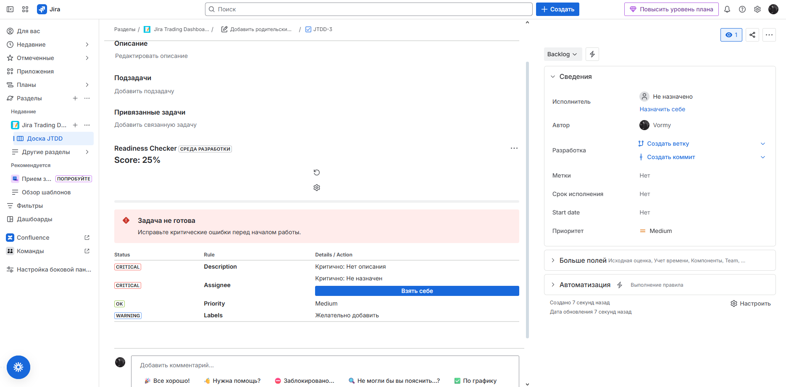
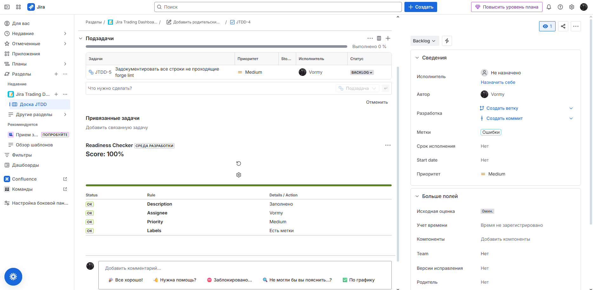
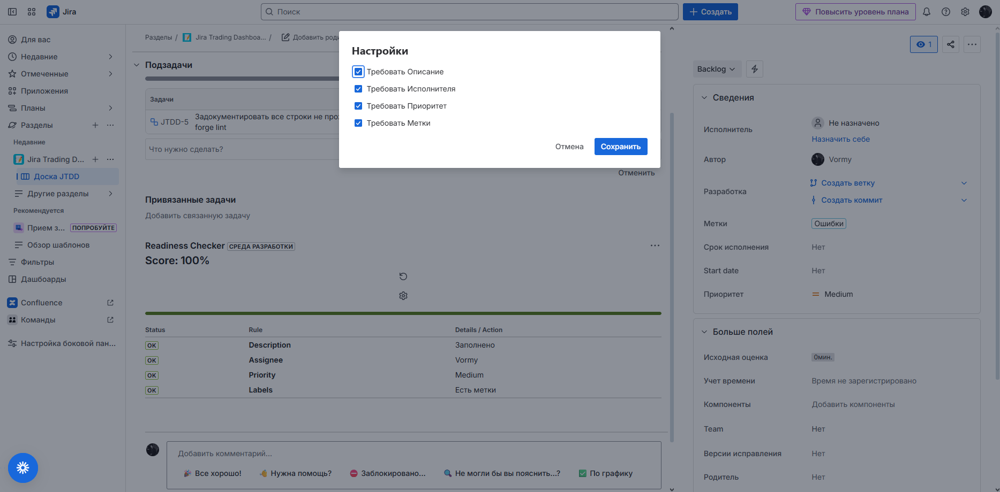
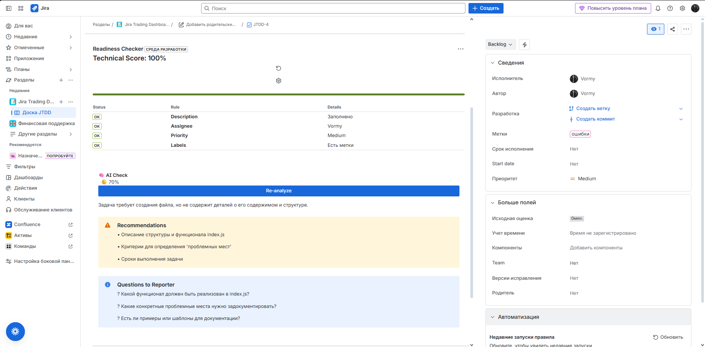

# Smart Issue Readiness Checker (Jira Forge)

**Smart Issue Readiness Checker** — это плагин для Jira Cloud, разработанный на платформе Atlassian Forge. Он помогает командам соблюдать стандарты качества задач (Definition of Ready), автоматически проверяя заполненность полей перед началом работы.

## Основные возможности

*   **Scoring System:** Визуальная оценка готовности задачи (0-100%).
*   **Умные статусы:**
    *   🔴 **CRITICAL:** Блокирующие ошибки (например, нет Исполнителя).
    *   🟡 **WARNING:** Рекомендации (например, нет меток).
    *   🟢 **READY:** Задача полностью готова.
*   **Quick Actions:** Исправление ошибок в один клик (функция "Взять задачу на себя" прямо из интерфейса).
*   **Гибкие настройки:** Возможность включать/выключать правила через UI (настройки сохраняются в базе данных).
*   **Secure Storage:** Использование Forge Storage API для хранения конфигурации.

## Технический стек

*   **Platform:** Atlassian Forge (FaaS - Function as a Service)
*   **Frontend:** React, Atlassian UI Kit (Hooks, Dynamic Tables, Modals)
*   **Backend:** Forge Resolvers
*   **Permissions:** OAuth 2.0 scopes (`read:jira-work`, `write:jira-work`, `storage:app`)

### 1. Critical State & Quick Actions 
*Плагин обнаружил критические ошибки (нет исполнителя). Видна кнопка быстрого исправления "Взять себе".*



### 2. Ready State 
*Все правила соблюдены (Priority, Labels, Assignee). Задача готова к работе.*



### 3. Settings Configuration 
*Гибкая настройка правил. Можно отключать проверки (например, Labels), и Warning пропадет.*


### 4. AI Check
*Анализ с помощью искуственного интелекта с последующими рекомендациями*


## Установка и запуск

Для запуска проекта локально:

1.  Установите [Forge CLI](https://developer.atlassian.com/platform/forge/getting-started/).
2.  Клонируйте репозиторий:
    ```bash
    git clone https://github.com/ваш-ник/jira-readiness-checker.git
    ```
3.  Установите зависимости:
    ```bash
    npm install
    ```
4.  Разверните приложение:
    ```bash
    forge deploy
    forge install
    forge tunnel
    ```
